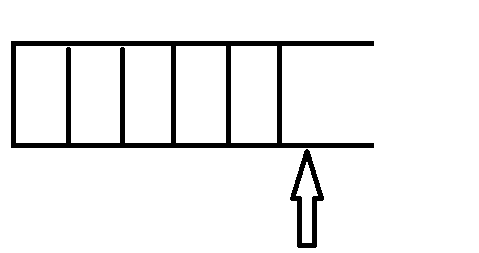
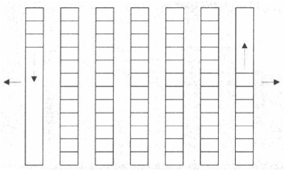

# STL

## 常用容器

### array----数组

 - 顺序容器
 - 大小固定

### vector---动态数组

- 顺序容器，线性连续空间，单口容器
- 大小自动扩容
- 支持随机访问
- 优点：占用空间小，遍历和随机访问速度快
- 缺点： 
	- 排序序列特别低，要移动大量元素
	- 扩容可能要开辟新的空间，将全部元素复制到新空间

```
insert(const_iterator pos, int count,ele);//迭代器指向位置pos插入count个元素ele.
push_back(ele); //尾部插入元素ele
pop_back();//删除最后一个元素
erase(const_iterator start, const_iterator end);//删除迭代器从start到end之间的元素
erase(const_iterator pos);//删除迭代器指向的元素
clear();//删除容器中所有元素
```

### deque---对顶栈，双口容器


- 顺序容器（伪），双口容器，由多个区块组成
- 自动扩容
- 支持随机访问，但不如vector快，因为要在不同区块跳转
- 优点：双向插入，扩容不需要移动大量元素
- 缺点：访问速度没有vector快 ，占用空间比vector大

```
deque.size();//返回容器中元素的个数
deque.empty();//判断容器是否为空
deque.resize(num);//重新指定容器的长度为num,若容器变长，则以默认值填充新位置。如果容器变短，则末尾超出容器长度的元素被删除。
deque.resize(num, elem); //重新指定容器的长度为num,若容器变长，则以elem值填充新位置,如果容器变短，则末尾超出容器长度的元素被删除。

push_back(elem);//在容器尾部添加一个数据
push_front(elem);//在容器头部插入一个数据
pop_back();//删除容器最后一个数据
pop_front();//删除容器第一个数据

erase(pos);//删除pos位置的数据，返回下一个数据的位置。
```

### stack---栈

- 尾插，尾删（没有迭代器）
- 底层用depue实现
- 自动扩容
底层实现分析：stack功能上更类似于vector却选择了底层用deque实现
1. stack在尾部插入删除，这一点deque和vector都可以实现
2. stack不需要遍历，只是查看尾部元素，这一点vector随机访问比deque快是的优势没有意义了
3. stack在对尾部插入时，可能需要扩容，而vector扩容可能需要开辟新的空间移动大量元素到新空间，而deque因为采用区块存储即使开辟新空间也只是开辟一个新的区块无需移动元素

```
push(elem);//向栈顶添加元素
pop();//从栈顶移除第一个元素
top();//返回栈顶元素
empty();//判断堆栈是否为空
size();//返回堆栈的大小
```

### queue---队列

- 先进先出（没有迭代器）
- 底层deque容器（实现分析同stack的实现分析）
- 自动扩容

```
push(elem);//往队尾添加元素
pop();//从队头移除第一个元素
back();//返回最后一个元素
front();//返回第一个元素
empty();//判断堆栈是否为空
size();//返回堆栈的大小
```

### list---双向循环链表

- 随机插入删除
- 提供迭代器
- 优点：插入删除快
- 缺点：遍历速度远远比vector慢

### set/multiset

- 区别：set中不允许有重复元素，multiset中允许
- 特点：内部是有序序列
- 自身是既是键又是值，会被排序
- 底层实现是红黑树
- 只能增删，不能修改

### map/multimap---键值对

- 有键和值，会被排序
- 底层红黑树
- 只能增删，不能修改

## 容器对比

|	- |vector | 	deque | 	list	  |  set	   |multiset   |	map	  |multimap |
|----------|-----------|-----------|---------|-------------|---------|------------|-----------|
|典型内存结构	|单端数组|	双端数组	|双向链表|	二叉树|	二叉树|	二叉树|	二叉树|
|可随机存取|	是|	是|	否|	否|	否|	对key而言：是|	否|
|元素搜寻速度|	慢|	慢|	非常慢|	快|	快|	对key而言：快|	对key而言：快|
|元素安插移除|	尾端|	头尾两端	|任何位置 |	- |	-|	-|	-|


遍历速度：vector>deque>list
随机插入速度：list>deque>vector
某端插入速度：deque>vector(尾插)>list

## 迭代器

### list容器插入，遍历

```
int main()
{
    list<int> mylist;
    mylist.push_back(1);
    mylist.push_back(2);
    mylist.push_back(3);
    list<int>::iterator it;
    it=mylist.begin();
    it++;
    //it=mylist[1];//错误：不支持随机访问
    mylist.insert(it,19);
    for(it=mylist.begin();it!=mylist.end();it++)
    {
        printf("%d\n",*it);
    }
    return 0;
}
```

### set容器遍历

```
int main()
{
    set<int> myset;
    myset.insert(10);
    myset.insert(4);
    myset.insert(20);
    myset.insert(8);
    set<int>::iterator it;
    for(it=myset.begin();it!=myset.end();it++)
    {
        printf("%d\n",*it);
    }

    return 0;
}
```
