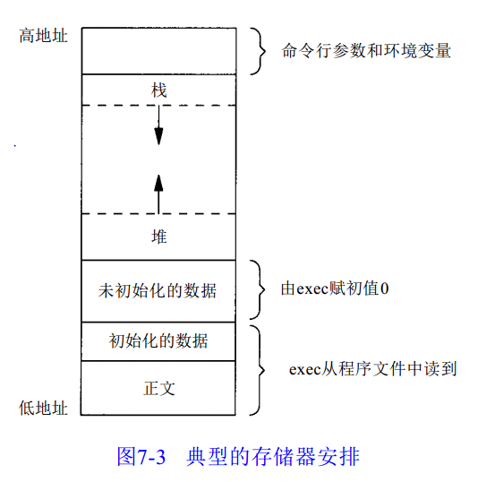

# c程序内存四区

## 内存分布（引自APUE.7-5）

- `正文段`（代码段）。这是由C P U执行的机器指令部分。通常，正文段是可共享的，所以即使是经常执行的程序(如文本编辑程序、 C编译程序、 shell等)在存储器中也只需有一个副本，另外，正文段常常是只读的，以防止程序由于意外事故而修改其自身的指令。
- `初始化数据段`。通常将此段称为数据段，它包含了程序中需赋初值的变量。例如， C程序中任何函数之外的说明：int maxcount = 99;使此变量以初值存放在初始化数据段中。
- `非初始化数据段`。通常将此段称为 b s s段，这一名称来源于早期汇编程序的一个操作符，意思是“block started by symbol（由符号开始的块）”，在程序开始执行之前，内核将此段初始化为0。函数外的说明：long sum[1000] ;使此变量存放在非初始化数据段中。
- `栈`。自动变量以及每次函数调用时所需保存的信息都存放在此段中。每次函数调用时，其返回地址、以及调用者的环境信息（例如某些机器寄存器）都存放在栈中。然后，新被调用的函数在栈上为其自动和临时变量分配存储空间。通过以这种方式使用栈， C函数可以递归调用。
- `堆`。通常在堆中进行动态存储分配。由于历史上形成的惯例，堆位于非初始化数据段顶和栈底之间。

### 内存四区
- 代码区
- 全局区（初始化数据段+未初始化数据段）
- 栈区
- 堆区