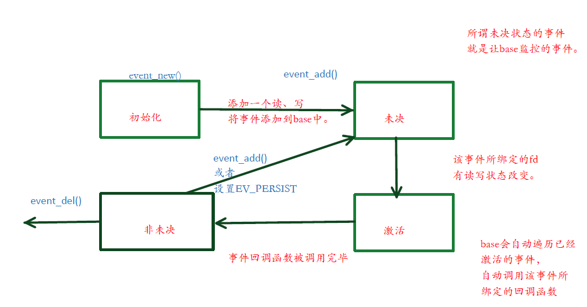

# libevent
相关资料：


[libevent 入门.pdf](libevent 入门.pdf )

[libevent参考手册(中文版).pdf](libevent参考手册-中文版.pdf )

[libevent源码深度剖析.pdf](libevent源码深度剖析.pdf )


## libevent事件



## libevent的API基本使用
libevent相关函数调用，gcc编译时加动态库 -levent


### 基本API
1. 定义相关结构体
```
//要监听的event	
struct event *ev1,*ev2;
//轮询时间为5s一次,在event_new设置EV_PERSIST后event_add时使用
struct timeval five_seconds = {5,0};
//base
struct event_base *base ;
```

2. 初始化base(event_base_new)
```
*base = event_base_new();
```

3. 初始化event(event_new)
```
//创建ev1,设置

//参数1：设置将加入到base中（只是加入并未激活）
//参数2：EV_TIMEOUT设置超时，EV_READ监听读事件，EV_PERSIST设置问轮询
//参数3：fun:回调函typedef void (*event_callback_fn)(evutil_socket_t, short, void *)
//参数4:回调函数的参数arg
//回调函数：参数一就是文件描述符fd,参数二是触发添加：egEV_READ或EV_TIMEOUT，参数三：参数arg
ev1 = event_new(base,fd1,EV_TIMEOUT|EV_READ|EV_PERSIST,fun,(char*)"reading");
//EV_PERSIST监听写事件
ev2 = event_new(base,fd2,EV_WRITE,fun,(char*)"write");
```

4. 将event加入到base中(event_add)
```
//初始化--->未决(event添加到base)
event_add(ev1,&five_seconds);
event_add(ev2,NULL);
```

5.  base循环监听(event_base_dispatch)
```
event_base_dispatch(base);
```


### bufevent

#### sample中的heloworld.c解析


```
#include <string.h>
#include <errno.h>
#include <stdio.h>
#include <signal.h>
#ifndef WIN32
#include <netinet/in.h>
# ifdef _XOPEN_SOURCE_EXTENDED
#  include <arpa/inet.h>
# endif
#include <sys/socket.h>
#endif

#include <event2/bufferevent.h>
#include <event2/buffer.h>
#include <event2/listener.h>
#include <event2/util.h>
#include <event2/event.h>

static const char MESSAGE[] = "Hello, World!\n";

static const int PORT = 9995;

static void listener_cb(struct evconnlistener *, evutil_socket_t,
    struct sockaddr *, int socklen, void *);
static void conn_writecb(struct bufferevent *, void *);
static void conn_eventcb(struct bufferevent *, short, void *);
static void signal_cb(evutil_socket_t, short, void *);

int
main(int argc, char **argv)
{
	struct event_base *base;
	struct evconnlistener *listener;
	struct event *signal_event;

	struct sockaddr_in sin;


    //创建一个base
	base = event_base_new();
	if (!base) {
		fprintf(stderr, "Could not initialize libevent!\n");
		return 1;
	}

    //初始化IP， listen的server的 ip
	memset(&sin, 0, sizeof(sin));
	sin.sin_family = AF_INET;
	sin.sin_port = htons(PORT);

    //创建一个listen的fd的事件, 同时将这个事件让base监听， 实际上监听的就是lfd的读事件
	listener = evconnlistener_new_bind(base, listener_cb, (void *)base,
	    LEV_OPT_REUSEABLE|LEV_OPT_CLOSE_ON_FREE, -1,
	    (struct sockaddr*)&sin,
	    sizeof(sin));

	if (!listener) {
		fprintf(stderr, "Could not create a listener!\n");
		return 1;
	}

    //创建一个信号事件，绑定SIGINT信号， 当收到信号会触发 signal_cb 函数
	signal_event = evsignal_new(base, SIGINT, signal_cb, (void *)base);

    //如果信号事件创建成功， 将信号事件从 初始化 --->未决
	if (!signal_event || event_add(signal_event, NULL)<0) {
		fprintf(stderr, "Could not create/add a signal event!\n");
		return 1;
	}

    //进入循环监控
	event_base_dispatch(base);

    //回收一些资源
	evconnlistener_free(listener);
	event_free(signal_event);
	event_base_free(base);

	printf("done\n");
	return 0;
}

/* -------------------------------------------*/
/**
 * @brief  listener_cb 
 *
 * @param listener  之前创建的 listenner 事件的地址
 * @param fd       实际上  已经accept成功的 cfd
 * @param sa         客户端的 地址
 * @param socklen    客户端地址长度
 * @param user_data  上层给回调函数传递的形参
 */
/* -------------------------------------------*/
static void listener_cb(struct evconnlistener *listener, evutil_socket_t fd,struct sockaddr *sa, int socklen, void *user_data)
{
//整体功能：将已经accept客户端的fd 绑定一个事件，让base监控

	struct event_base *base = user_data;
	struct bufferevent *bev;
    //创建一个bufferevent(把fd包裹为bev，也就是加入到一个event中)
	bev = bufferevent_socket_new(base, fd, BEV_OPT_CLOSE_ON_FREE);
	if (!bev) {
		fprintf(stderr, "Error constructing bufferevent!");
		event_base_loopbreak(base);
		return;
	}
    //给bufferevent 设置读、写 回调函数
    //此bufferevent 仅仅绑定了一个写回调函数
	bufferevent_setcb(bev, NULL, conn_writecb, conn_eventcb, NULL);
    //启动bufferevent的写事件监听
	bufferevent_enable(bev, EV_WRITE);

    //启动bufferevent的写事件监听
	bufferevent_disable(bev, EV_READ);

    //实际上 message 只是写到bufferevent 写缓冲区中
	bufferevent_write(bev, MESSAGE, strlen(MESSAGE));
}

static void
conn_writecb(struct bufferevent *bev, void *user_data)
{
    //将bufferevent中的 输出缓冲区中拿出数据地址
	struct evbuffer *output = bufferevent_get_output(bev);
    
	if (evbuffer_get_length(output) == 0) {
		printf("flushed answer\n");
        //由于设置了BEV_OPT_CLOSE_ON_FREE, 当free bufferevent事件的时候，也会将所关联的fd， close

		bufferevent_free(bev);
	}
}

static void
conn_eventcb(struct bufferevent *bev, short events, void *user_data)
{
	if (events & BEV_EVENT_EOF) {
		printf("Connection closed.\n");
	} else if (events & BEV_EVENT_ERROR) {
		printf("Got an error on the connection: %s\n",
		    strerror(errno));/*XXX win32*/
	}
	/* None of the other events can happen here, since we haven't enabled
	 * timeouts */
	bufferevent_free(bev);
}

static void
signal_cb(evutil_socket_t sig, short events, void *user_data)
{
	struct event_base *base = user_data;
	struct timeval delay = { 2, 0 };

	printf("Caught an interrupt signal; exiting cleanly in two seconds.\n");

	event_base_loopexit(base, &delay);
}

```

#### 小写转大写示例

```
#include <event2/listener.h>
#include <event2/bufferevent.h>
#include <event2/buffer.h>
#include <arpa/inet.h>
#include <string.h>
#include <stdlib.h>
#include <stdio.h>
#include <errno.h>

//小写转大写
void  str_toupper(char *str)
{
    int i;
    for (i = 0; i < strlen(str); i ++)
    {  
        str[i] = toupper(str[i]);
    }
}

static void
echo_read_cb(struct bufferevent *bev, void *ctx)
{
    //char *buf;
    char buf[100];
    int len =0;
    int size  =0;

     //从 bufferevent 得到 输入缓冲区的 首地址
    //struct evbuffer *input = bufferevent_get_input(bev);
    //得到输入缓冲区数据的长度
    //len = evbuffer_get_length(input);
    //buf = malloc(sizeof(char)*len);
    do{
        //从bev的读缓冲区读sizeof(buf)的数据到buf中
        size = bufferevent_read(bev,buf,sizeof(buf));
        str_toupper(buf);
        //向写缓冲区写数据
        bufferevent_write(bev,buf,size);
    }while(size == sizeof(buf));
    //free(buf);

    //从 bufferevent 得到 输出缓冲区的 首地址
   // struct evbuffer *output = bufferevent_get_output(bev);
    //将读缓冲区写到写缓冲区实现回射服务器
    //evbuffer_add_buffer(output, input);
}

static void
echo_event_cb(struct bufferevent *bev, short events, void *ctx)
{
    if (events & BEV_EVENT_ERROR)
        perror("Error from bufferevent");
    if (events & (BEV_EVENT_EOF | BEV_EVENT_ERROR)) {
        bufferevent_free(bev);
    }
} 

static void
/* -------------------------------------------*/
/**
 * @brief  accept_conn_cb 
 *
 * @param listener  listenner事件
 * @param fd        cfd 已经accept成功的
 * @param address   客户端地址
 * @param socklen   客户端长度
 * @param ctx       形参
 */
/* -------------------------------------------*/
accept_conn_cb(struct evconnlistener *listener,
        evutil_socket_t fd, struct sockaddr *address, int socklen,
        void *ctx)
{
    /* We got a new connection! Set up a bufferevent for it.
     */
    struct event_base *base = evconnlistener_get_base(listener);

    //创建一个bufferevent
    struct bufferevent *bev = bufferevent_socket_new(
            base, fd, BEV_OPT_CLOSE_ON_FREE);

    //给bufferevent设置回调函数
    bufferevent_setcb(bev, echo_read_cb, NULL, echo_event_cb, NULL);

    //启动bufferevent的 事件监控
    bufferevent_enable(bev, EV_READ|EV_WRITE);
}
static void
accept_error_cb(struct evconnlistener *listener, void *ctx)
{
    struct event_base *base = evconnlistener_get_base(listener);

    int err = EVUTIL_SOCKET_ERROR();
    fprintf(stderr, "Got an error %d (%s) on the listener. "
            "Shutting down.\n", err, evutil_socket_error_to_string(err));
    event_base_loopexit(base, NULL);
} 

int main(int argc, char **argv)
{
    
    struct event_base *base;

    struct evconnlistener *listener;

    struct sockaddr_in sin;

    int port = 9876;
    if (argc > 1) {
        port = atoi(argv[1]);
    } 
    if (port<=0 || port>65535) {
        puts("Invalid port");
        return 1;
    } 

    //创建一个base
    base = event_base_new();
    if (!base) {
        puts("Couldn't open event base");
        return 1;
    } 
    /* Clear the sockaddr before using it, in case there are
        extra
        * platform-specific fields that can mess us up. */
    memset(&sin, 0, sizeof(sin));
    /* This is an INET address */
    sin.sin_family = AF_INET;
    /* Listen on 0.0.0.0 */
    sin.sin_addr.s_addr = htonl(0);
    /* Listen on the given port. */
    sin.sin_port = htons(port);

    //绑定一个listenner事件，同时指定一个linsterner事件的回调函数
    listener = evconnlistener_new_bind(base, accept_conn_cb,
            NULL,
            LEV_OPT_CLOSE_ON_FREE|LEV_OPT_REUSEABLE, -1,
            (struct sockaddr*)&sin, sizeof(sin));

    if (!listener) {
        perror("Couldn't create listener");
        return 1;
    } 

    evconnlistener_set_error_cb(listener, accept_error_cb);

    //进入循环监控
    event_base_dispatch(base);

    return 0;
}

```