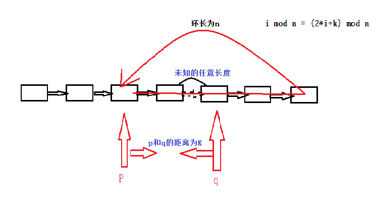

# 判断一个链表是否存在环

1. 指针p和q都指向头
2. 每次p走一步，q走两步
3. 若q走都末尾，即q=NULL则无环，若q=p则有环

算法分析：为什么通过这种方式可以判断出有环无环
1. 设环长为n
2. 当p进入环时开始计数，i
3. 设此时p的位置为k

将q进入环的位置记为0,此时p的位置为k

推导：
1. i % n == (2*i+k)%n
2. i - x*n == 2*i+k-y*n  （其中x,y可以为任意数）
3. i-k = (y-x)*n    (化简结果)
4. i-k = z*n    (以为x,y可以使任意数，y-x用z代替)
5. 结果：i为步数，k,n为任意常数，z为任意解，不管k和n为什么值，一定存在i和z使等式平衡